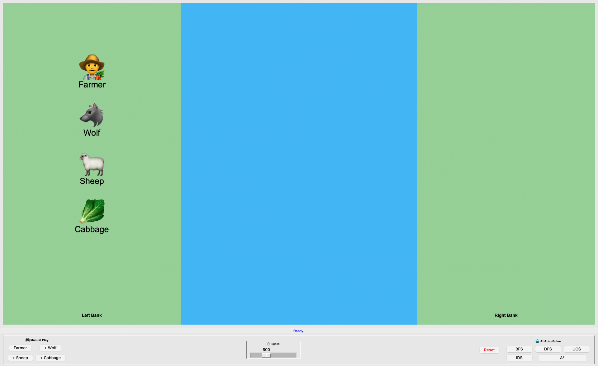

[](https://github.com/muhammadibn3bdullah/aialgorithm/actions/workflows/python-app.yml)
# 🌾 Farmer, Wolf, Sheep, and Cabbage AI Solver


> An interactive AI-powered simulation to solve the classic river crossing puzzle using state-space search algorithms.

---

## 📸 Demo & Screenshots

*(The interactive GUI allows manual play and AI auto-solving)*

---

## 🧠 About The Project
This project was developed as part of the **Artificial Intelligence (CS 365)** course. It demonstrates the practical application of **Problem-Solving Agents** by implementing 5 different search strategies to solve the puzzle optimally.

### Features
- 🎮 **Interactive GUI:** Built from scratch using Python's Tkinter.
- 🕹️ **Manual Mode:** Test your logic! The game prevents invalid moves (e.g., leaving the Wolf with the Sheep).
- 🤖 **AI Auto-Solve:** Visualize how algorithms search for the solution step-by-step.
- ⚡ **Speed Control:** Adjustable animation speed for better understanding.
- 📱 **Responsive:** Adapts to different screen sizes.

---

## 🚀 Algorithms Implemented

| Algorithm | Type | Description | Optimality |
| :--- | :---: | :--- | :---: |
| **BFS** | Uninformed | Breadth-First Search. Explores level by level. | ✅ Optimal |
| **DFS** | Uninformed | Depth-First Search. Explores deep paths first. | ❌ Not Optimal |
| **UCS** | Uninformed | Uniform Cost Search. Explores based on path cost. | ✅ Optimal |
| **IDS** | Uninformed | Iterative Deepening Search. Mixes BFS & DFS. | ✅ Optimal |
| **A*** | Informed | A-Star Search. Uses heuristic $h(n)$ (items on wrong bank). | ✅ Optimal & Fast |

---

## 🛠️ How to Run

### 1. Clone the Repository
```bash

git clone https://github.com/muhammadibn3bdullah/aialgorithm.git
cd aialgorithm
